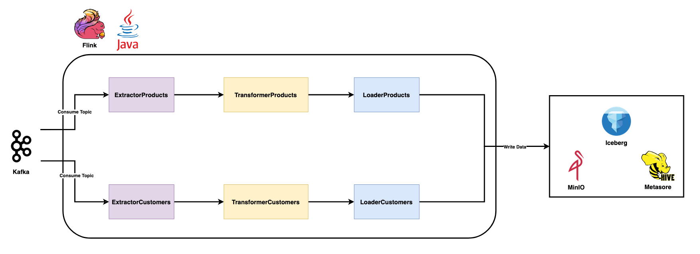

# Flink-ETL-Archetype



#### **A project template that advocates standards around coding and design of ETL apps based on Flink, Java, Iceberg, MinIO, and Hive Metastore**

#### **Requirements:**
* Flink: 1.20.0
* Java: Microsoft 11
* Maven
* Intellij idea

#### **✨ Features**

- **Apache Flink 1.20.x Support: Supports Apache Flink version 1.20.x for real-time data processing.**

- **Kafka Source and Sink Support: Enables data ingestion (source) and delivery (sink) via Apache Kafka.**

- **Iceberg Integration: Provides data lake compatibility by supporting data writing (sink) to Apache Iceberg tables.** 

- **Hive Compatibility: Ensures integration with Apache Hive for batch processing and catalog management.**

- **S3 File System Support: Allows reading and writing data to S3-compatible file systems such as MinIO and AWS S3.**

- **Parquet Format Compatibility: Supports the Parquet file format for efficient data storage and processing.**

- **Maven-Based Build System: Uses Maven for project and dependency management.**

#### **🛠️ Technologies Used**

This project uses the following tools and libraries:

| Tool/Library | Version         |
|----------------|-----------------|
| Java           | 11              |
| Apache Flink   | 1.20.0          |
| Kafka          | 3.4.0           |
| Apache Iceberg | 1.7.1           |
| Apache Hive    | 3.1.3           |
| Hadoop         | 3.3.2           |
| AWS SDK        | 2.29.42         |


#### **Program Arguments**

```bash
--data-source-0 customers --data-source-1 products --deploy-mode prod --target-schema-0 prod --target-table-0 customers --target-table-1 products 
```


#### **Warnings/Points to note**

* "**Run->Edit Configurations...->Modify options->Add dependencies with "provided" scope to classpath**" Activate it.

* **Commands to remove locks from PostgreSQL if a table is locked in Hive.**

```sql
DELETE FROM HIVE_LOCKS WHERE hl_db='prod' and hl_table = 'customers';
DELETE FROM HIVE_LOCKS WHERE hl_db='prod' and hl_table = 'products';
```

* **Enter your own S3 information in the appropriate places in the [core-site.xml](src/main/resources/core-site.xml) file.**

* **Enter your own kafka brokers into [ConfigKafka.java](src/main/java/org/demir/utils/ConfigKafka.java).**

* **Enter your Iceberg configs into the [ConfigIceberg.java](src/main/java/org/demir/utils/ConfigIceberg.java) file.**


#### **[Best Practices for Deploying Apache Flink with High Availability on Kubernetes](https://medium.com/@ahmetfurkandemir/kubernetes-with-data-engineering-approach-6-best-practices-for-deploying-apache-flink-with-high-e3b9e67f8d87)**
